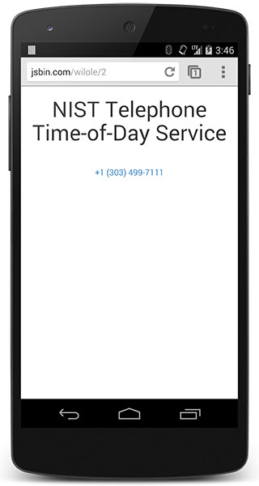

# 01 Click to call

In this guide

- [Link telephone numbers for click to call](#link-telephone-numbers-for-click-to-call)
- [Use the international dialing format](#use-the-international-dialing-format)
- [Disable auto-detection when necessary](#disable-auto-detection-when-necessary)
- [Other click to call features](#other-click-to-call-features)

**TL;DR**

- Wrap all phone numbers in hyperlinks with the `tel`: schema.
- Always use the international dialing format.

## Link telephone numbers for click to call

HTML:

    NIST Telephone Time-of-Day Service <a href="tel:+1-303-499-7111">+1 (303) 499-7111</a>

## Use the international dialing format

Always supply the phone number using the international dialing format: **the plus sign** (`+`), **country code**, **area code** and **number**. While not absolutely necessary, it’s a good idea to separate each segment of the number with a **hyphen** (`-`) for easier reading and better auto-detection.

## Disable auto-detection when necessary

HTML:

    <meta name="format-detection" content="telephone=no">

## Other click to call features

In addition to the `tel:` schema, some modern browsers also support the `sms:` and `mms:` schemas, though support is not as consistent, and some features like setting the message body don’t always work.
