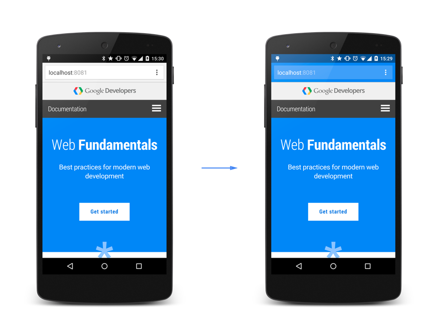

# 06 Additional Customizations

## Color the browser elements

    <!-- Chrome & Firefox OS -->
    <meta name="theme-color" content="#4285f4">
    <!-- Windows Phone -->
    <meta name="msapplication-navbutton-color" content="#4285f4">
    <!-- iOS Safari -->
    <meta name="apple-mobile-web-app-status-bar-style" content="#4285f4">

## Safari: Startup images, status bar appearance

Safari allows you to style the status bar and specify a startup image.

### Specify a startup image

    <link rel="apple-touch-startup-image" href="icon.png">

The image has to be in the specific size of the target device’s screen or it won’t be used. Refer to [Safari Web Content Guidelines](https://developer.apple.com/library/ios/documentation/AppleApplications/Reference/SafariWebContent/ConfiguringWebApplications/ConfiguringWebApplications.html) for further details.

While Apple’s documentation is sparse on this topic, the developer community has figured out a way to target all devices by using advanced media queries to select the appropriate device and then specify the correct image. Here’s a working solution, courtesy of [tfausak’s gist](https://gist.github.com/tfausak/2222823):

    <!-- iOS 6 & 7 iPad (retina, portrait) -->
    <link href="/static/images/apple-touch-startup-image-1536x2008.png"
         media="(device-width: 768px) and (device-height: 1024px)
            and (orientation: portrait)
            and (-webkit-device-pixel-ratio: 2)"
         rel="apple-touch-startup-image">

    <!-- iOS 6 & 7 iPad (retina, landscape) -->
    <link href="/static/images/apple-touch-startup-image-1496x2048.png"
         media="(device-width: 768px) and (device-height: 1024px)
            and (orientation: landscape)
            and (-webkit-device-pixel-ratio: 2)"
         rel="apple-touch-startup-image">

    <!-- iOS 6 iPad (portrait) -->
    <link href="/static/images/apple-touch-startup-image-768x1004.png"
         media="(device-width: 768px) and (device-height: 1024px)
            and (orientation: portrait)
            and (-webkit-device-pixel-ratio: 1)"
         rel="apple-touch-startup-image">

    <!-- iOS 6 iPad (landscape) -->
    <link href="/static/images/apple-touch-startup-image-748x1024.png"
         media="(device-width: 768px) and (device-height: 1024px)
            and (orientation: landscape)
            and (-webkit-device-pixel-ratio: 1)"
         rel="apple-touch-startup-image">

    <!-- iOS 6 & 7 iPhone 5 -->
    <link href="/static/images/apple-touch-startup-image-640x1096.png"
         media="(device-width: 320px) and (device-height: 568px)
            and (-webkit-device-pixel-ratio: 2)"
         rel="apple-touch-startup-image">

    <!-- iOS 6 & 7 iPhone (retina) -->
    <link href="/static/images/apple-touch-startup-image-640x920.png"
         media="(device-width: 320px) and (device-height: 480px)
            and (-webkit-device-pixel-ratio: 2)"
         rel="apple-touch-startup-image">

    <!-- iOS 6 iPhone -->
    <link href="/static/images/apple-touch-startup-image-320x460.png"
         media="(device-width: 320px) and (device-height: 480px)
            and (-webkit-device-pixel-ratio: 1)"
         rel="apple-touch-startup-image">

### Change the status bar appearance

    <meta name="apple-mobile-web-app-status-bar-style" content="black">

And here is a preview of how the different modes look:

## Internet Explorer: Live Tiles, notifications and pinned sites

Microsoft’s “Pinned Sites” and their rotating “Live Tiles” go far beyond other implementations and covering them here would blow up this guide. If you’d like to [learn more, learn how to create live tiles at MSDN](https://msdn.microsoft.com/en-us/library/ie/dn455115(v=vs.85).aspx).
