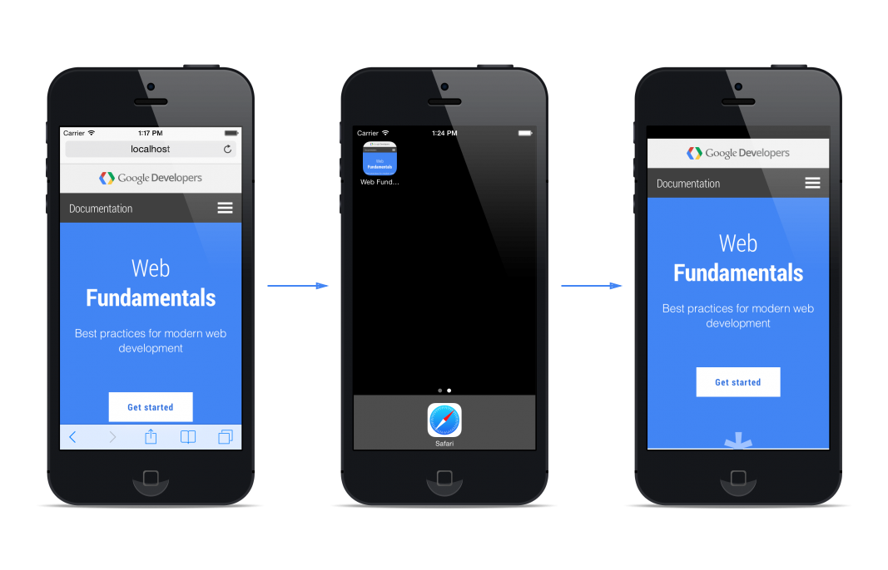

# 02 Hide the Browser UI

Add the following code to the `<head>` of your page:

    <meta name="apple-mobile-web-app-capable" content="yes">

This will tell Mobile Safari that it’s dealing with a web app.

Internet Explorer doesn’t require instructions for this, as sites will launch fullscreen by default

