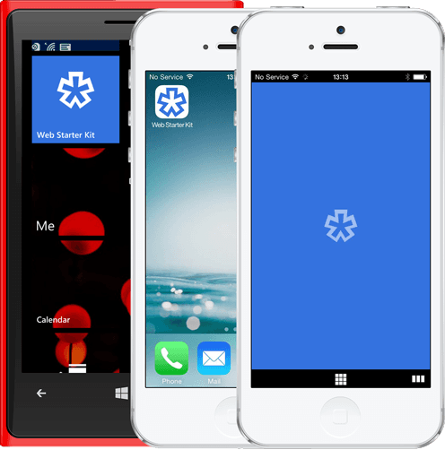

# 03 Specify an Icon

Add the following code to your `<head>` to add a custom icon to Safari, Opera and Internet Explorer:

    <!-- icon in the highest resolution we need it for -->
    <link rel="icon" sizes="228x228" href="icon.png">
    <!-- reuse same icon for Safari -->
    <link rel="apple-touch-icon" href="ios-icon.png">
    <!-- multiple icons for IE -->
    <meta name="msapplication-square70x70logo" content="icon\_smalltile.png">
    <meta name="msapplication-square150x150logo" content="icon\_mediumtile.png">
    <meta name="msapplication-wide310x150logo" content="icon\_widetile.png">
    <meta name="msapplication-square310x310logo" content="icon\_largetile.png">

In this example, Opera uses the icon.png, which is scaled to the necessary size by the device. Safari uses the `<link>` tag with the `rel` attribute: `apple-touch-icon`.

Windows 8’s new home screen experience supports four different layouts for pinned sites, and requires four icons. You can leave out the relevant meta tags if you don’t want to support a specific size.

You can specify explicit sizes by providing a separate link tag for each icon, preventing the OS from having to resize the icon:

    <link rel="apple-touch-icon" href="touch-icon-iphone.png">
    <link rel="apple-touch-icon" sizes="76x76" href="touch-icon-ipad.png">
    <link rel="apple-touch-icon" sizes="120x120" href="touch-icon-iphone-retina.png">
    <link rel="apple-touch-icon" sizes="152x152" href="touch-icon-ipad-retina.png">
