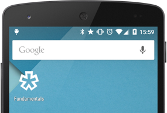
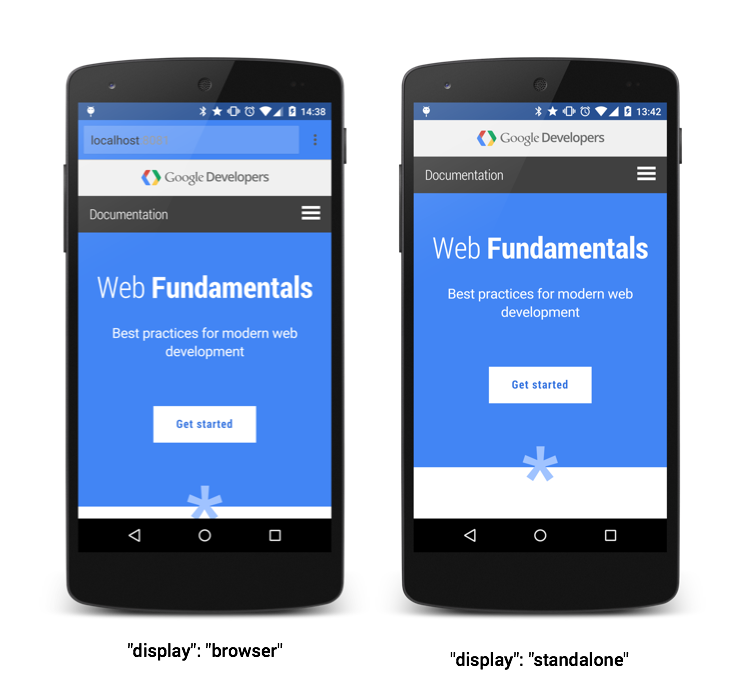
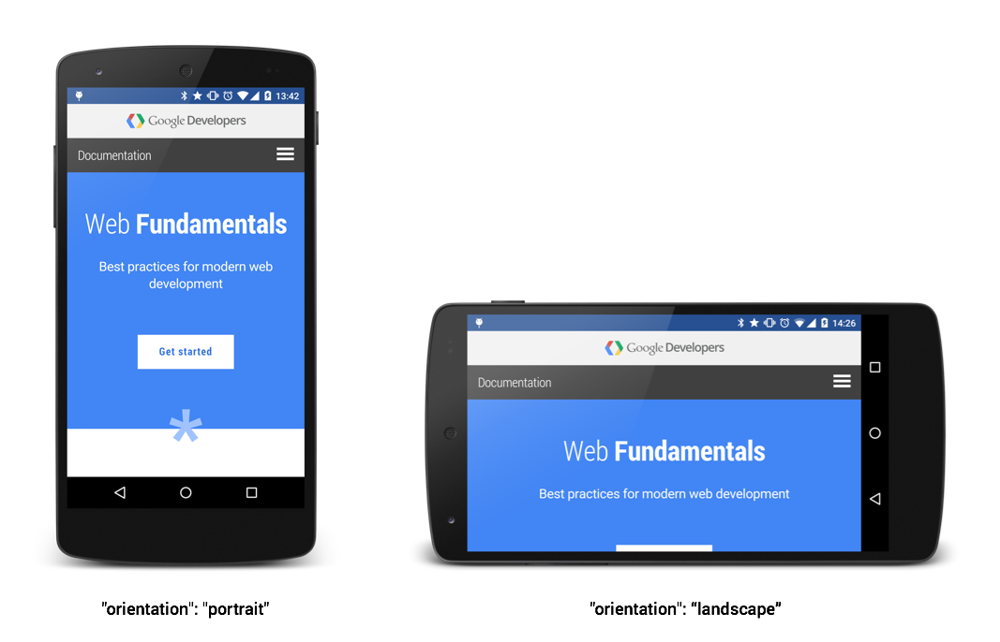

# 01 Add a WebApp Manifest

**TL;DR**

- Define a range of icons so that they work across all device form factors
- Choose a good `short_name` as this is what users will see
- Add a launch URL and a Querystring parameter so that you can track how many users launch your app

## Creating the manifest

You can call the manifest whatever you want. Most people will probably just use manifest.json. An example is given below.

    {
      "short_name": "Kinlan's Amaze App",
      "name": "Kinlan's Amazing Application ++",
      "icons": [
        {
          "src": "launcher-icon-0-75x.png",
          "sizes": "36x36"
        },
        {
          "src": "launcher-icon-1x.png",
          "sizes": "48x48"
        },
        {
          "src": "launcher-icon-1-5x.png",
          "sizes": "72x72"
        },
        {
          "src": "launcher-icon-2x.png",
          "sizes": "96x96"
        },
        {
          "src": "launcher-icon-3x.png",
          "sizes": "144x144"
        },
        {
          "src": "launcher-icon-4x.png",
          "sizes": "192x192"
        }
      ],
      "start_url": "index.html",
      "display": "standalone"
    }

You should include a **short_name** as this will get used for the launcher text.

If you don’t provide a **start_url**, then the current page will be used, which is unlikely to be what your users want.

## Tell the browser about your manifest

    <link rel="manifest" href="/manifest.json">

## Create great app icons for the device

## Configure how your site is lauched

## Define the initial orientation of the page

## Is it safe to use today. A.K.A Browser Support

Yes. This is a progressive feature that if you support, users of browsers that can handle this feature will get a better experience. If the browser doesn’t support the manifest then users are not stopped from using the site.

As of Nov 2014 Chrome has implemented the manifest. Mozilla are implementing and [IE is exploring the area](https://status.modern.ie/webapplicationmanifest?term=manifest).
