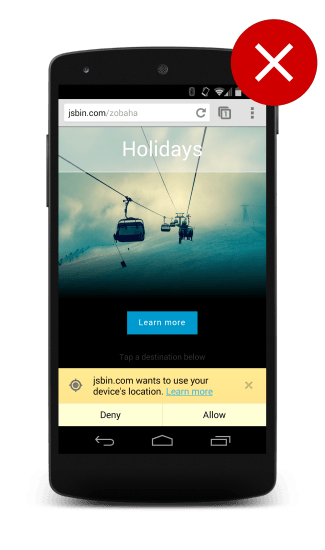
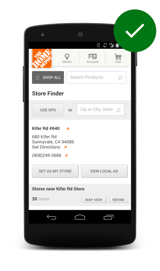
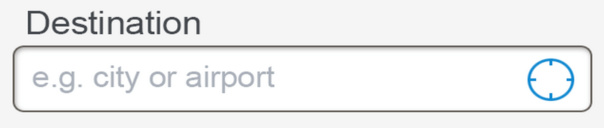
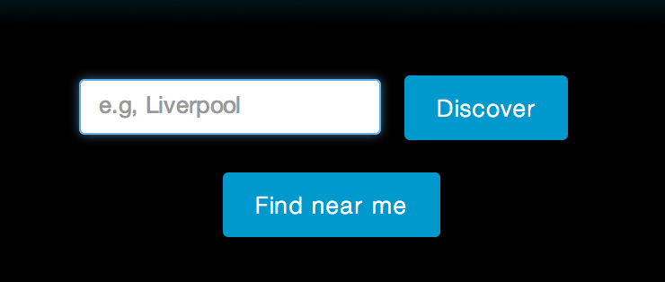

# 03 Getting the user to consent to location sharing

**TL;DR**

- Assume users will not give you their location.
- Make it clear why you need access to the user's location.
- Don't immediately prompt for access on page load.

## Assume users will not give you their location

1. Handle all errors out of the geolocation API so that you can adapt your site to this condition.
2. Be clear and explicit about your need for the location.
3. Use a fallback solution if needed.

## Use a fallback if geolocation is required

Our recommendation is to not tie your site or application in to requiring access to the user’s current location, but if your application or site absolutely requires it there are 3rd party solutions that allow you to obtain a best guess of where the person currently is.

## Always request access to location on a user gesture

## Give clear indication that an action will request their location

## Gently nudge users to grant permission to their location

1. Setup a timer that will trigger after a short period - 5 seconds is a good value.
2. If you get an error message, show a message to the user.
3. If you get a positive response, disable the timer and process the results.
4. If after the timeout you haven’t got a positive response, show a notification to the user.
5. If the response comes in later and the notification is still present, remove it from the screen.

JS:

    button.onclick = function() {
      var startPos;
      var element = document.getElementById("nudge");

      var showNudgeBanner = function() {
        nudge.style.display = "block";
      };

      var hideNudgeBanner = function() {
        nudge.style.display = "none";
      };

      var nudgeTimeoutId = setTimeout(showNudgeBanner, 5000);

      var geoSuccess = function(position) {
        hideNudgeBanner();
        // We have the location, don't display banner
        clearTimeout(nudgeTimeoutId); 

        // Do magic with location
        startPos = position;
        document.getElementById('startLat').innerHTML = startPos.coords.latitude;
        document.getElementById('startLon').innerHTML = startPos.coords.longitude;
      };
      var geoError = function(error) {
        switch(error.code) {
          case error.TIMEOUT:
            // The user didn't accept the callout
            showNudgeBanner();
            break;
      };

      navigator.geolocation.getCurrentPosition(geoSuccess, geoError);
    };
