# 02 Choose the best input type

**TL;DR**

- Choose the most appropriate input type for your data to simplify input.
- Offer suggestions as the user types with the datalist element.

### HTML5 input types

Input `type` | Typical Keyboard
------------ | ----------------
`url` For entering a URL. It must start with a valid URI scheme, for example `http://`, `ftp://` or `mailto:`. | 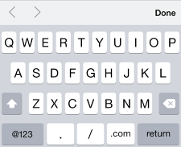
`tel` For entering phone numbers. It does **not** enforce a particular syntax for validation, so if you want to ensure a particular format, you can use pattern. | 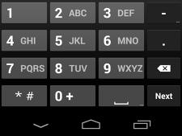
`email` For entering email addresses, and hints that the @ should be shown on the keyboard by default. You can add the multiple attribute if more than one email address will be provided. | 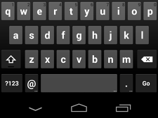
`search` A text input field styled in a way that is consistent with the platform's search field. | 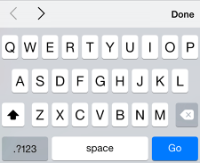
`number` For numeric input, can be any rational integer or float value. | 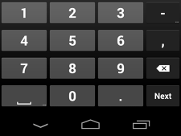
`range` For number input, but unlike the number input type, the value is less important. It is displayed to the user as a slider control. | 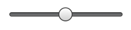
`datetime-local` For entering a date and time value where the time zone provided is the local time zone. | 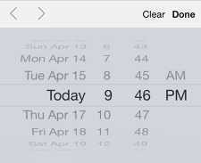
`date` For entering a date (only) with no time zone provided. | 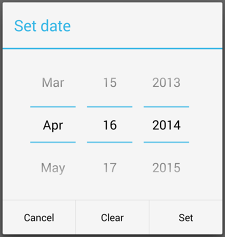
`time` For entering a time (only) with no time zone provided. | 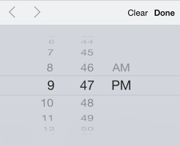
`week` For entering a week (only) with no time zone provided. | 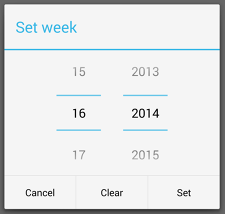
`month` For entering a month (only) with no time zone provided. | 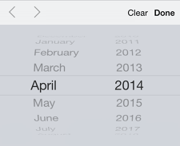
`color` For picking a color. | 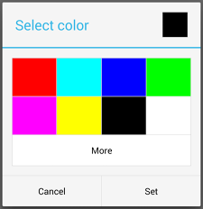

### Offer suggestions during input with datalist

    <label for="frmFavChocolate">Favorite Type of Chocolate</label>
    <input type="text" name="fav-choc" id="frmFavChocolate" list="chocType">
    <datalist id="chocType">
      <option value="white">
      <option value="milk">
      <option value="dark">
    </datalist>

[sample](samples/order.html)
