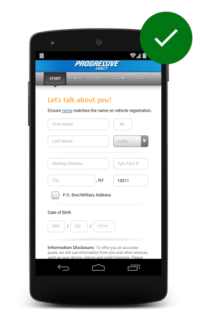

# 01 Design efficient forms

In this guide

- [Minimize repeated actions and fields](#minimize-repeated-actions-and-fields)
- [Show users how far along they are](#show-users-how-far-along-they-are)
- [Provide visual calendars when selecting dates](#provide-visual-calendars-when-selecting-dates)

**TL;DR**

- Use existing data to pre-populate fields and be sure to enable auto-fill.
- Use clearly-labeled progress bars to help users get through multi-part forms.
- Provide visual calendar so users don’t have to leave your site and jump to the calendar app on their smartphones.

## Minimize repeated actions and fields

## Show users how far along they are

## Provide visual calendars when selecting dates

