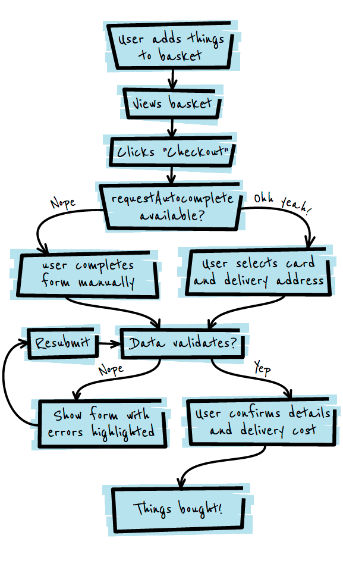

# 05 Simplify checkout with requestAutocomplete API

**TL;DR**

- `requestAutocomplete` can greatly simplify the checkout process and improve the user experience.
- If `requestAutocomplete` is available, hide the checkout form and move people directly to the confirmation page.
- Ensure input fields include the appropriate autocomplete attribute.

### `requestAutocomplete` flow

    var doRAC = document.getElementById("doRAC");
    doRAC.addEventListener("click", doRequestAutocomplete);

    form = document.getElementById("usrForm");
    form.addEventListener("autocompleteerror", requestAutocompleteError);
    form.addEventListener("autocomplete", requestAutocompleteCompleted);

    if (form.requestAutocomplete) {
      isRACSupported(true, "");
    } else {
      isRACSupported(false, "Please complete the form manually.");
    }

[sample](samples/rac.html)

    function requestAutocompleteCompleted(evt) {
      console.log("requestAutocomplete Completed", evt);
      form.classList.toggle("hidden", false);
    }

    function requestAutocompleteError(evt) {
      console.log("requestAutocomplete Error", evt);
      isRACSupported(false, "An error occured attempting to autocomplete the form.");
    }
