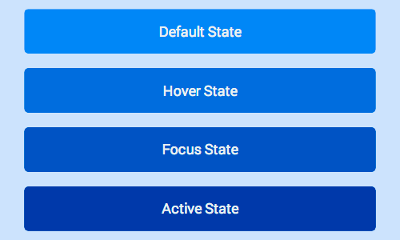
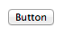

# 01 Stateful Elements Respond to Touch

## Add Touch States

### Use Pseudo Classes to Change UI for each Touch State

**TL;DR**

- Make your site feel snappy and responsive: change the UI for each state `:hover`, `:active` and `:focus`.
- Don’t override a browser’s default responses to touch and focus unless you are implementing your own UI changes.
- Disable text selection on elements users will touch, unless there’s a good reason why users might need to copy / select the text.

CSS:

    .btn {
      background-color: #4285f4;
    }

    .btn:hover {
      background-color: #296CDB;
    }

    .btn:focus {
      background-color: #0F52C1;
    
      /* The outline parameter surpresses the border
      color / outline when focused */
      outline: 0;
    }

    .btn:active {
      background-color: #0039A8;
    }

[sample](samples/states-example.html)

### Hover and Focus Stickiness

On most mobile browsers `hover` and/or `focus` states will apply to an element after it’s been tapped.

### Enabling Active State Support on iOS

Unfortunately, Safari on iOS does not apply the `active` state by default, to get it working you need to add a `touchstart` event listener to the `document body` or to each element.

You should do this behind a user agent test so it’s only run on iOS devices.

Adding a touch start to the body has the advantage of applying to all elements in the DOM, however this may have performance issues when scrolling the page.

    window.onload = function() {
      if(/iP(hone|ad)/.test(window.navigator.userAgent)) {
        document.body.addEventListener('touchstart', function() {}, false);
      }
    };

The alternative is to add the touch start listeners to all the interactable elements in the page, alleviating some of the performance concerns.

    window.onload = function() {
      if(/iP(hone|ad)/.test(window.navigator.userAgent)) {
        var elements = document.querySelectorAll('button');
        var emptyFunction = function() {};
        for(var i = 0; i < elements.length; i++) {
          elements[i].addEventListener('touchstart', emptyFunction, false);
        }
      }
    };

### Override Default Browser Styles for Touch States

#### Override Tap Highlight Styles

    /* Webkit / Chrome Specific CSS to remove tap highlight color */
    .btn {
      -webkit-tap-highlight-color: transparent;
    }

Internet Explorer on Windows Phone has a similar behavior, but is suppressed via a meta tag:

    <meta name="msapplication-tap-highlight" content="no">

#### Override FirefoxOS Button State Styles

    /* Firefox Specific CSS to remove button differences and focus ring */
    .btn {
      background-image: none;
    }

    .btn::-moz-focus-inner {
      border: 0;
    }

#### Override Element Outline in Focus State

    .btn:focus {
      outline: 0;

      // Add replacement focus styling here (i.e. border)
    }

### Disable user-select on UI which Responds to Touch

    -moz-user-select: none;
    -webkit-user-select: none;
    -ms-user-select: none;
    user-select: none;

## Reference

### Pseudo Classes for Touch States

Class | Example | Description
----- | ------- | -----------
`:hover` |  | This state is entered when a is cursor placed over an element. Changes in UI on hover are helpful to encourage users to interact with elements.
`:focus` |  | When you tab through elements on a page, you are moving the focus from one element to the next. The focus state allows the user to know what element they are currently interacting with; also allows users to navigate your UI easily using a keyboard.
`:active` |  | This is the state an element has when it's being selected, for example a user clicking or touching an element.
