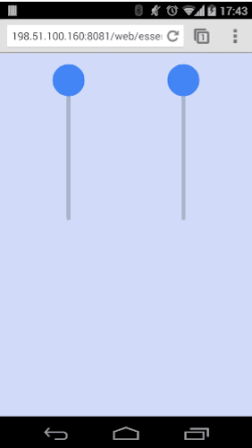
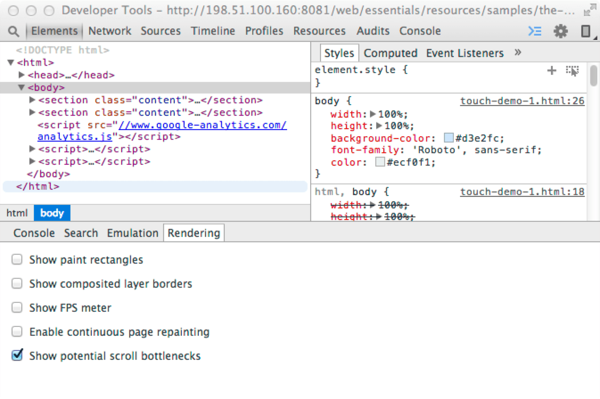
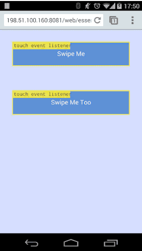

# 02 Implement Custom Gestures

In this guide

- [Respond to Touch Input Using Events](#respond-to-touch-input-using-events)
- [Responding to Touch Efficiently](#responding-to-touch-efficiently)
- [Control Gestures using Touch Actions](#control-gestures-using-touch-actions)
- [Reference](#reference)

## Respond to Touch Input Using Events

- I want the user to interact with one particular element.
- I want the user to interact with multiple elements at the same time.

**TL;DR**

- For full device support, handle touch, mouse and Pointer Events.
- Always bind start event listeners to the element itself.
- If you want the user to interact with one particular element, bind your move and end listeners to the document in the touchstart method; ensure you unbind them from the document in the end listener.
- If you want to support multi-touch, either restrict move and end touch events to the element itself or handle all the touches on an element.

### Add Event Listeners

Touch events and mouse events are implemented on most mobile browsers.

The event names you need to implement are `touchstart`, `touchmove`, `touchend` and `touchcancel`.

For some situations, you may find that you would like to support mouse interaction as well; which you can do with the mouse events: `mousedown`, `mousemove`, and `mouseup`.

For Windows Touch devices, you need to support Pointer Events which are a new set of events. Pointer Events merge mouse and touch events into one set of callbacks. This is currently only supported in Internet Explorer 10+ with the prefixed events `MSPointerDown`, `MSPointerMove`, and `MSPointerUp` and in IE 11+ the unprefixed events `pointerdown`, `pointermove`, and `pointerup`.

    // Check if pointer events are supported.
    if (window.PointerEventsSupport) {
      // Add Pointer Event Listener
      swipeFrontElement.addEventListener(pointerDownName, this.handleGestureStart, true);
    } else {
      // Add Touch Listener
      swipeFrontElement.addEventListener('touchstart', this.handleGestureStart, true);

      // Add Mouse Listener
      swipeFrontElement.addEventListener('mousedown', this.handleGestureStart, true);
    }

[sample](samples/touch-demo-1.html)

    var pointerDownName = 'MSPointerDown';
    var pointerUpName = 'MSPointerUp';
    var pointerMoveName = 'MSPointerMove';

    if(window.PointerEvent) {
      pointerDownName = 'pointerdown';
      pointerUpName = 'pointerup';
      pointerMoveName = 'pointermove';
    }

    // Simple way to check if some form of pointerevents is enabled or not
    window.PointerEventsSupport = false;
    if(window.PointerEvent || window.navigator.msPointerEnabled) {
      window.PointerEventsSupport = true;
    }

### Handle Single-Element Interaction

The steps taken to implement this are:

1. Add the start events listener to an element.
2. Inside your touch start method, bind the move and end elements to the document. The reason for binding the move and end events to the document is so that we receive all events regardless of whether they occur on the original element or not.
3. Handle the move events.
4. On the end event, remove the move and end listeners from the document.

Below is a snippet of our `handleGestureStart` method which adds the move and end events to the document:

    // Handle the start of gestures
    this.handleGestureStart = function(evt) {
      evt.preventDefault();

      if(evt.touches && evt.touches.length > 1) {
        return;
      }

      // Add the move and end listeners
      if (window.PointerEventsSupport) {
        // Pointer events are supported.
        document.addEventListener(pointerMoveName, this.handleGestureMove, true);
        document.addEventListener(pointerUpName, this.handleGestureEnd, true);
      } else {
        // Add Touch Listeners
        document.addEventListener('touchmove', this.handleGestureMove, true);
        document.addEventListener('touchend', this.handleGestureEnd, true);
        document.addEventListener('touchcancel', this.handleGestureEnd, true);

        // Add Mouse Listeners
        document.addEventListener('mousemove', this.handleGestureMove, true);
        document.addEventListener('mouseup', this.handleGestureEnd, true);
      }

      initialTouchPos = getGesturePointFromEvent(evt);

      swipeFrontElement.style.transition = 'initial';
    }.bind(this);

The end callback we add is `handleGestureEnd` which removes the move and end events from the document when the gesture has finished:

    // Handle end gestures
    this.handleGestureEnd = function(evt) {
      evt.preventDefault();

      if(evt.touches && evt.touches.length > 0) {
        return;
      }

      isAnimating = false;

      // Remove Event Listeners
      if (window.PointerEventsSupport) {
        // Remove Pointer Event Listeners
        document.removeEventListener(pointerMoveName, this.handleGestureMove, true);
        document.removeEventListener(pointerUpName, this.handleGestureEnd, true);
      } else {
        // Remove Touch Listeners
        document.removeEventListener('touchmove', this.handleGestureMove, true);
        document.removeEventListener('touchend', this.handleGestureEnd, true);
        document.removeEventListener('touchcancel', this.handleGestureEnd, true);

        // Remove Mouse Listeners
        document.removeEventListener('mousemove', this.handleGestureMove, true);
        document.removeEventListener('mouseup', this.handleGestureEnd, true);
      }

      updateSwipeRestPosition();
    }.bind(this);

You can use the [Show potential scroll bottlenecks](https://developer.chrome.com/devtools/docs/rendering-settings#show-potential scroll bottlenecks) feature in Chrome DevTools to show how the touch events behave:

With this enabled you can see where touch events are bound and ensure your logic for adding and removing listeners is working as you’d expect.

### Handle Multi-Element Interaction

    // Check if pointer events are supported.
    if (window.PointerEventsSupport) {
      // Add Pointer Event Listener
      elementHold.addEventListener(pointerDownName, this.handleGestureStart, true);
      elementHold.addEventListener(pointerMoveName, this.handleGestureMove, true);
      elementHold.addEventListener(pointerUpName, this.handleGestureEnd, true);
    } else {
      // Add Touch Listeners
      elementHold.addEventListener('touchstart', this.handleGestureStart, true);
      elementHold.addEventListener('touchmove', this.handleGestureMove, true);
      elementHold.addEventListener('touchend', this.handleGestureEnd, true);
      elementHold.addEventListener('touchcancel', this.handleGestureEnd, true);

      // Add Mouse Listeners
      elementHold.addEventListener('mousedown', this.handleGestureStart, true);
    }

[sample](samples/touch-demo-2.html)

In our `handleGestureStart` and `handleGestureEnd` function, we add and remove the mouse event listeners to the document.

    // Handle the start of gestures
    this.handleGestureStart = function(evt) {
      evt.preventDefault();

              var point = getGesturePointFromEvent(evt);
      initialYPos = point.y;
    
      if (!window.PointerEventsSupport) {
        // Add Mouse Listeners
        document.addEventListener('mousemove', this.handleGestureMove, true);
        document.addEventListener('mouseup', this.handleGestureEnd, true);
      }
    }.bind(this);

    this.handleGestureEnd = function(evt) {
      evt.preventDefault();
    
      if(evt.targetTouches && evt.targetTouches.length > 0) {
        return;
      }
    
      if (!window.PointerEventsSupport) {
        // Remove Mouse Listeners
        document.removeEventListener('mousemove', this.handleGestureMove, true);
        document.removeEventListener('mouseup', this.handleGestureEnd, true);
      }

      isAnimating = false;
      lastHolderPos = lastHolderPos + -(initialYPos - lastYPos);
    }.bind(this);

## Responding to Touch Efficiently

### Get and Store Touch Event Coordinates

    function getGesturePointFromEvent(evt) {
      var point = {};

      if(evt.targetTouches) {
        // Prefer Touch Events
        point.x = evt.targetTouches[0].clientX;
        point.y = evt.targetTouches[0].clientY;
      } else {
        // Either Mouse event or Pointer Event
        point.x = evt.clientX;
        point.y = evt.clientY;
      }

      return point;
    }

Each touch event has three lists containing touch data (see also Touch lists):

- `touches`: list of all current touches on the screen, regardless of DOM element they are on.
- `targetTouches`: list of touches currently on the DOM element the event is bound to.
- `changedTouches`: list of touches which changed resulting in the event being fired.

In most cases, `targetTouches` gives you everything you need.

### requestAnimationFrame

    // Handle the start of gestures
    this.handleGestureStart = function(evt) {
      evt.preventDefault();

      if(evt.touches && evt.touches.length > 1) {
        return;
      }

      // Add the move and end listeners
      if (window.PointerEventsSupport) {
        // Pointer events are supported.
        document.addEventListener(pointerMoveName, this.handleGestureMove, true);
        document.addEventListener(pointerUpName, this.handleGestureEnd, true);
      } else {
        // Add Touch Listeners
        document.addEventListener('touchmove', this.handleGestureMove, true);
        document.addEventListener('touchend', this.handleGestureEnd, true);
        document.addEventListener('touchcancel', this.handleGestureEnd, true);

        // Add Mouse Listeners
        document.addEventListener('mousemove', this.handleGestureMove, true);
        document.addEventListener('mouseup', this.handleGestureEnd, true);
      }

      initialTouchPos = getGesturePointFromEvent(evt);

      swipeFrontElement.style.transition = 'initial';
    }.bind(this);

The `handleGestureMove` method stores the `y` position before requesting an animation frame if we need to, passing in our `onAnimFrame` function as the callback:

    var point = getGesturePointFromEvent(evt);
    lastYPos = point.y;
    
    if(isAnimating) {
      return;
    }

    isAnimating = true;
    window.requestAnimFrame(onAnimFrame);

Once we’ve set the transform, we set the `isAnimating` variable to `false` so the next touch event will request a new animation frame.

    function onAnimFrame() {
      if(!isAnimating) {
        return;
      }

      var newYTransform = lastHolderPos + -(initialYPos - lastYPos);

      newYTransform = limitValueToSlider(newYTransform);

      var transformStyle = 'translateY('+newYTransform+'px)';
      elementHold.style.msTransform = transformStyle;
      elementHold.style.MozTransform = transformStyle;
      elementHold.style.webkitTransform = transformStyle;
      elementHold.style.transform = transformStyle;

      isAnimating = false;
    }

## Control Gestures using Touch Actions

    /* Pass all touches to javascript */
    -ms-touch-action: none;
    touch-action: none;

Below is a list of the available parameters for `touch-action`.

Property | Description
-------- | -----------
`touch-action: auto` | The browser will add the normal touch interactions which it supports. For example, scrolling in the x-axis, scrolling in the y-axis, pinch zoom and double tap.
`touch-action: none` | No touch interactions will be handled by the browser.
`touch-action: pan-x` | Only horizontal scrolling will be handled by the browser; vertical scrolling and gestures will be disabled.
`touch-action: pan-y` | Only vertical scrolling will be handled by the browser; horizontal scrolling and gestures will be disabled.
`touch-action: manipulation` | Scrolling in both directions and pinch zooming will be handled by the browser; all other gesture will be ignored by the browser.

**Remember**

- Using `touch-action: pan-x` or `touch-action: pan-y` are great for being explicit in your intention that a user should only ever scroll vertically or horizontally on an element.

## Reference

The definitive touch events reference can be found here: [w3 Touch Events](http://www.w3.org/TR/touch-events/).

### Touch, Mouse, and Pointer events

Touch, Mouse, Pointer Events | Description
---------------------------- | -----------
`touchstart`, `mousedown`, `pointerdown` | This is called when a finger first touches an element or when the user clicks down on the mouse.
`touchmove`, `mousemove`, `pointermove` | This is called when the user moves their finger across the screen or drags with the mouse.
`touchend`, `mouseup`, `pointerup` | This is called when the user lifts their finger off of the screen or releases the mouse.
`touchcancel` | This is called when the browser cancels the touch gestures.

### Touch Lists

Attribute | Description
--------- | -----------
`touches` | List of all current touches on the screen, regardless of elements being touched.
`targetTouches` | List of touches that started on the element that is the target of the current event. For example, if you bind to a `<button>`, you'll only get touches currently on that button. If you bind to the document, you'll get all touches currently on the document.
`changedTouches` | List of touches which changed resulting in the event being fired: For the [touchstart](http://www.w3.org/TR/touch-events/#dfn-touchstart) event-- list of the touch points that just became active with the current event. For the [touchmove](http://www.w3.org/TR/touch-events/#dfn-touchmove) event-- list of the touch points that have moved since the last event. For the [touchend](http://www.w3.org/TR/touch-events/#dfn-touchend) and [touchcancel](http://www.w3.org/TR/touch-events/#dfn-touchcancel) events-- list of the touch points that have just been removed from the surface.
