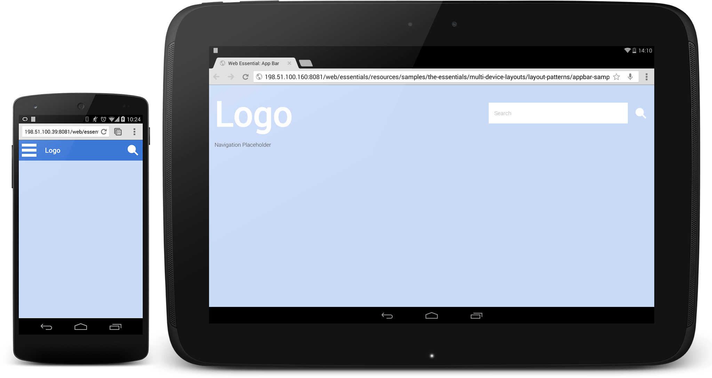
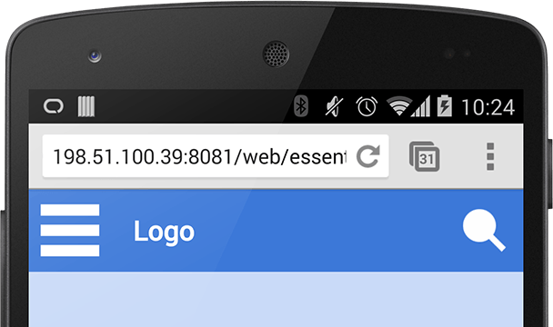
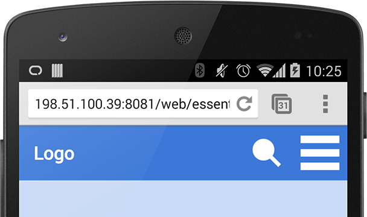
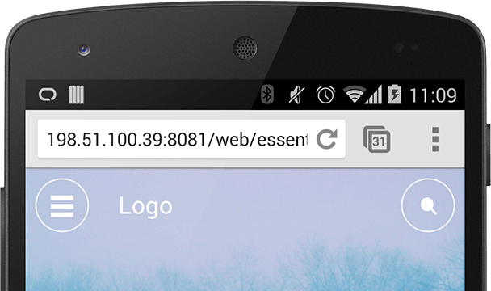
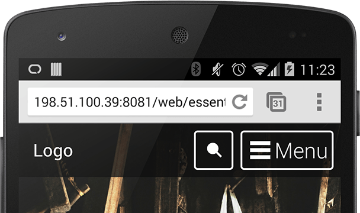

# 01 App Bar

[Demo](samples/appbar-navdrawer-sample1.html)

**TL;DR**

- Your logo should be placed at the top of each screen and take the user back to your homepage.
- If you have a menu button, place it on the far left or far right of the App Bar and keep it in the same place throughout your site.
- Key actions for your page should be kept in the App Bar.

The App Bar consists of three elements.

- Your sites logo
- Primary actions
- (Optional) Menu button

## Left vs Right Menu Button

[Demo](samples/appbar-navdrawer-sample1.html)

[Demo](samples/appbar-navdrawer-sample2.html)

## Guidelines

[Demo](samples/appbar-navdrawer-bottombar-sample.html)

[Demo](samples/appbar-navdrawer-sample.html)
