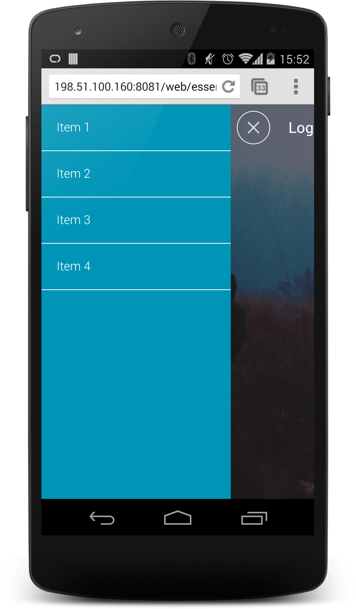
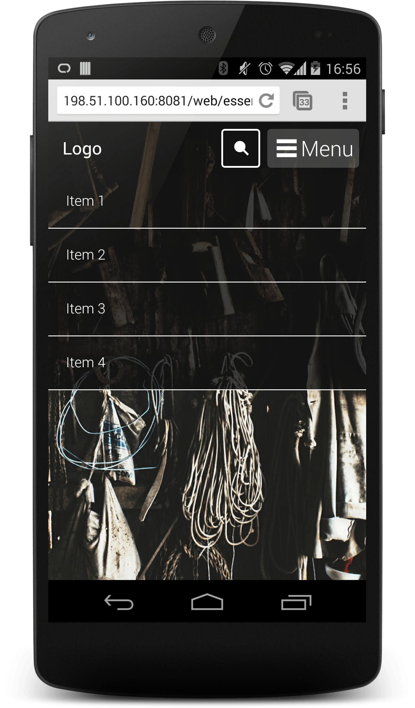
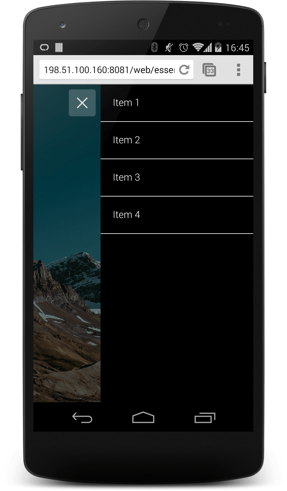

# 03 Navigation Drawer

[Demo](samples/appbar-navdrawer-sample1.html)

**TL;DR**

- Your Navigation Drawer should be easily accessible to the user.
- If the number of sections is too large, consider grouping the items and expanding / contracting the groups. Avoid overwhelming your users.
- Don't hide key actions inside the drawer. Actions like search should be prominently on the home page, not hidden in the drawer.

[Demo](samples/appbar-navdrawer-bottombar-sample.html)

[Demo](samples/appbar-navdrawer-sample.html)

[Demo](samples/navdrawer-sample4.html)

### Tabs vs Navigation Drawer

Some developers find they get higher rates of interaction when using a tab bar instead of a Navigation Drawer.

The choice is a trade off between the flexibility of the Navigation Drawer with the visibility of a Tab Bar which you should consider what is best suited to your site.
