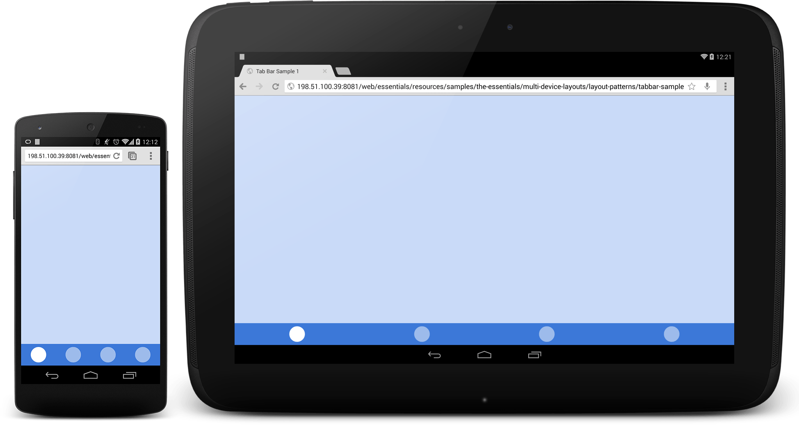
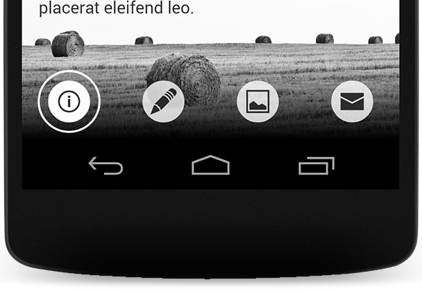
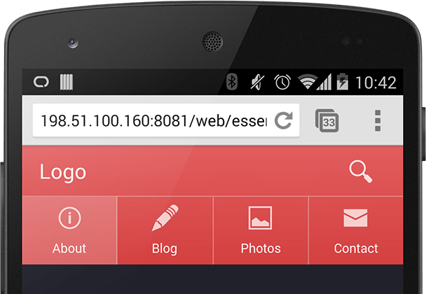

# 02 Tab Bar

[Demo](samples/tabbar-sample1.html)

**TL;DR**

- Use only if your site has no more than five sections.
- Position below or above your main content.
- Make it clear to the user which section is currently selected.

[Demo](samples/tabbar-sample2.html)

[Demo](samples/tabbar-sample3.html)
