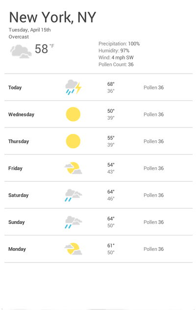
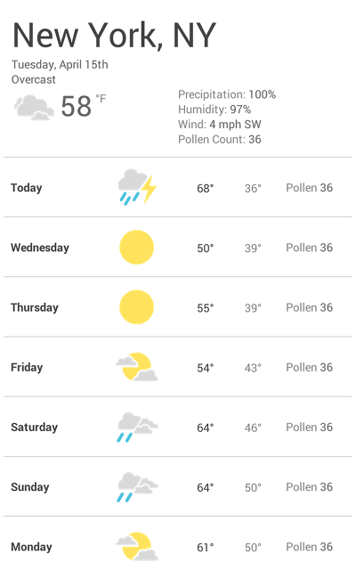
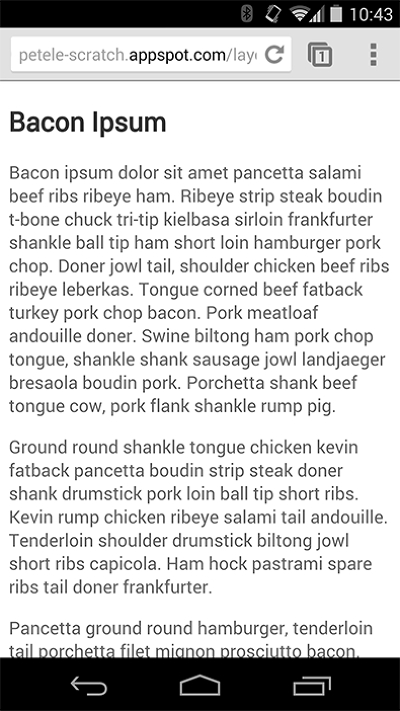
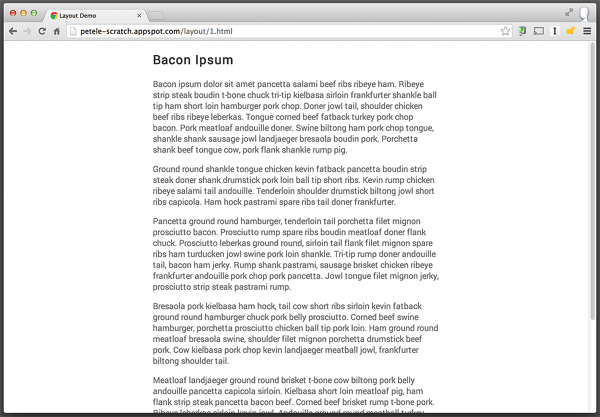

# 04 How to choose breakpoints

**TL;DR**

- Create breakpoints based on content, never on specific devices, products or brands.
- Design for the smallest mobile device first, then progressively enhance the experience as more screen real estate becomes available.
- Keep lines of text to a maximum of around 70 or 80 characters.

## Pick major breakpoints by starting small, then working up

[sample 1](samples/weather-1.html)

    <link rel="stylesheet" href="weather.css">
    <link rel="stylesheet" media="(max-width:600px)" href="weather-2-small.css">
    <link rel="stylesheet" media="(min-width:601px)" href="weather-2-large.css">

[sample 2](samples/weather-2.html)

## Pick minor breakpoints when necessary

    @media (min-width: 360px) {
      body {
        font-size: 1.0em;
      }
    }
    
    @media (min-width: 500px) {
      .seven-day-fc .temp-low,
      .seven-day-fc .temp-high {
        display: inline-block;
        width: 45%;
      }
    
      .seven-day-fc .seven-day-temp {
        margin-left: 5%;
      }
    
      .seven-day-fc .icon {
        width: 64px;
        height: 64px;
      }
    }

[sample](samples/weather-small.css)

    @media (min-width: 700px) {
      .weather-forecast {
        width: 700px;
      }
    }

[sample](samples/weather-large.css)

## Optimize text for reading

传统的可读性理论建议：理想栏目的每一行应该包含 70 到 80 个字符（大约 8 到 10 个英文单词），因此，每次文本块宽度超过 10 个单词时，就应考虑添加断点。

我们来深入分析一下上述博文示例。在较小的屏幕上，大小为 1em 的 Roboto 字体可以使每行完美地呈现 10 个单词，而在较大的屏幕上就需要添加断点了。在本例中，如果浏览器宽度超过了 575 像素，那么内容的理想宽度是 550 像素。

    @media (min-width: 575px) {
      article {
        width: 550px;
        margin-left: auto;
        margin-right: auto;
      }
    }

[sample](samples/reading.html)

## Never completely hide content

在根据屏幕大小选择要隐藏或显示的内容时请务必谨慎。 不要只是因为内容无法适合屏幕而将其隐藏。屏幕大小并非确定用户需求的决定性因素。例如，如果去除天气预报中的花粉统计数据，那么对春天容易过敏的用户来说就是非常严重的问题，因为这些用户要根据这类信息决定是否外出。
