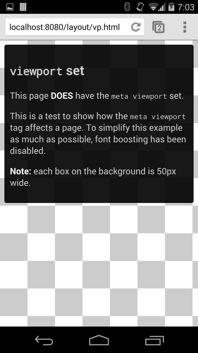

# 01 Set the viewport

**TL;DR**

- Use meta viewport tag to control the width and scaling of the browsers viewport.
- Include `width=device-width` to match the screen's width in device independent pixels.
- Include `initial-scale=1` to establish a 1:1 relationship between CSS pixels and device independent pixels.
- Ensure your page is accessible by not disabling user scaling.

HTML:

    <meta name="viewport" content="width=device-width, initial-scale=1">

[See example](samples/vp-no.html)

[See example](samples/vp.html)

**Remember**

- Use a comma to separate attributes to ensure older browsers can properly parse the attributes.

## Ensure an accessible viewport

In addition to setting an `initial-scale`, you can also set the following attributes on the viewport:

- `minimum-scale`
- `maximum-scale`
- `user-scalable`
