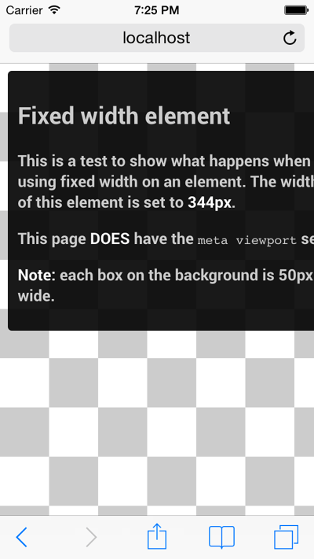
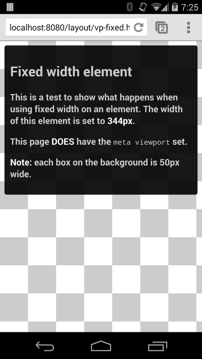

# 02 Size content to the viewport

**TL;DR**

- Do not use large fixed width elements.
- Content should not rely on a particular viewport width to render well.
- Use CSS media queries to apply different styling for small and large screens.

[See example](samples/vp-fixed.html)
