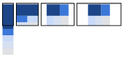

# 01 Mostly fluid

The mostly fluid pattern consists primarily of a fluid grid. On large or medium screens, it usually remains the same size, simply adjusting the margins on wider screens.

[Try it](samples/mostly-fluid.html)

Sites using this pattern include:

- [A List Apart](http://mediaqueri.es/ala/)
- [Media Queries](http://mediaqueri.es/)
- [SimpleBits](http://simplebits.com/)
