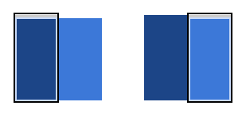

# 04 Animating Between Views

**TL;DR**

- Use transitions to move between views; avoid using `left`, `top` or any other property that triggers layout.
- Ensure any animations you use are snappy and the durations are kept short.
- Consider how your animations and layouts change as the screen sizes go up; what works for a smaller screen may look odd when used in a desktop context.

### Use translations to move between views

CSS:

    .container {
      width: 100%;
      height: 100%;
      overflow: hidden;
      position: relative;
    }

CSS:

    .view {
      width: 100%;
      height: 100%;
      position: absolute;
      left: 0;
      top: 0;

      /* let the browser know we plan to animate
         each view in and out */
      will-change: transform;
    }

CSS:

    .view {
      /* Prefixes are needed for Safari and other WebKit-based browsers */
      transition: -webkit-transform 0.3s cubic-bezier(0.465, 0.183, 0.153, 0.946);
      transition: transform 0.3s cubic-bezier(0.465, 0.183, 0.153, 0.946);
    }

CSS:

    .details-view {
      -webkit-transform: translateX(100%);
      transform: translateX(100%);
    }

JS:

    var container = document.querySelector('.container');
    var backButton = document.querySelector('.back-button');
    var listItems = document.querySelectorAll('.list-item');

    /**
     * Toggles the class on the container so that
     * we choose the correct view.
     */
    function onViewChange(evt) {
      container.classList.toggle('view-change');
    }

    // When you click on a list item bring on the details view.
    for (var i = 0; i < listItems.length; i++) {
      listItems[i].addEventListener('click', onViewChange, false);
    }

    // And switch it back again when you click on the back button
    backButton.addEventListener('click', onViewChange);

CSS:

    .view-change .list-view {
      -webkit-transform: translateX(-100%);
      transform: translateX(-100%);
    }

    .view-change .details-view {
      -webkit-transform: translateX(0);
      transform: translateX(0);
    }

[See sample.](samples/inter-view-animation.html)

### Ensure your animation works with larger screens

