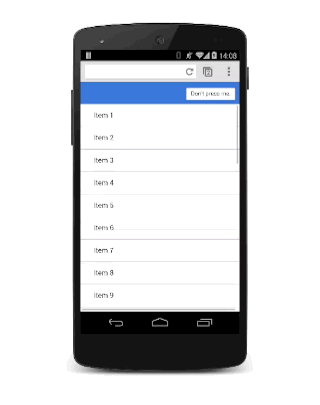

# 06 Animating Modal Views

**TL;DR**

- Modal views should be used sparingly; users will get frustrated if you interrupt their experience unnecessarily.
- Adding scale to the animation gives a nice 'drop on' effect.
- Be sure to get rid of the modal view quickly when the user dismisses it, but you should bring it on to screen a little more slowly so it doesn't surprise the user.

[See sample.](samples/modal-view-animation.html)

CSS:

    .modal {
      position: fixed;
      top: 0;
      left: 0;
      width: 100%;
      height: 100%;

      pointer-events: none;
      opacity: 0;

      will-change: transform, opacity;
    }

CSS:

    .modal.visible {
      pointer-events: auto;
      opacity: 1;
    }

JS:

    modal.classList.add('visible');

JS:

    .modal {
      -webkit-transform: scale(1.15);
      transform: scale(1.15);

      -webkit-transition:
        -webkit-transform 0.1s cubic-bezier(0.465, 0.183, 0.153, 0.946),
        opacity 0.1s cubic-bezier(0.465, 0.183, 0.153, 0.946);

      transition:
        transform 0.1s cubic-bezier(0.465, 0.183, 0.153, 0.946),
        opacity 0.1s cubic-bezier(0.465, 0.183, 0.153, 0.946);
    }

JS:

    .modal.visible {

      -webkit-transform: scale(1);
      transform: scale(1);

      -webkit-transition:
        -webkit-transform 0.3s cubic-bezier(0.465, 0.183, 0.153, 0.946),
        opacity 0.3s cubic-bezier(0.465, 0.183, 0.153, 0.946);

      transition:
        transform 0.3s cubic-bezier(0.465, 0.183, 0.153, 0.946),
        opacity 0.3s cubic-bezier(0.465, 0.183, 0.153, 0.946);
    }
