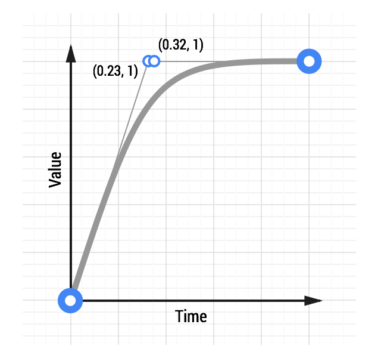

# 05 Choosing the Right Easing

__TL;DR__

* Use `ease-out` animations for UI elements; a Quintic `ease-out` is a very nice, albeit snappy, ease.
* Be sure to use the animation duration; `ease-out`s and `ease-in`s should be __200ms - 500ms__, whereas `bounce`s and `elastic` eases should clock in a longer duration of __800ms - 1200ms__.

[See a Quintic ease-out animation.](samples/box-move-quintic-ease-out.html)

Play around with eases, see which ones match your project’s personality, and go from there. A full list of easing types, along with demos, can be found at [easings.net](http://easings.net/).

### Pick the right animation duration

* __Ease-outs: around 200ms - 500ms__. This gives the eye chance to see the animation, but doesn’t feel obstructive.
* __Ease-ins: around 200ms - 500ms__. Bear in mind that it will jolt at the end and no amount of timing changes will soften that feel.
* __Bounce or elastic effects: around 800ms - 1200ms__. You need to allow time for the elastic or bounce effect to ‘settle’. Without this extra time the elastic bouncing part of the animation will be really aggressive and unpleasant to the eye.
