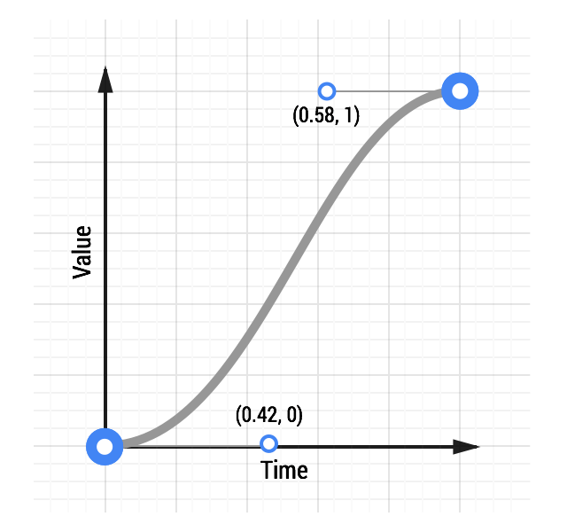
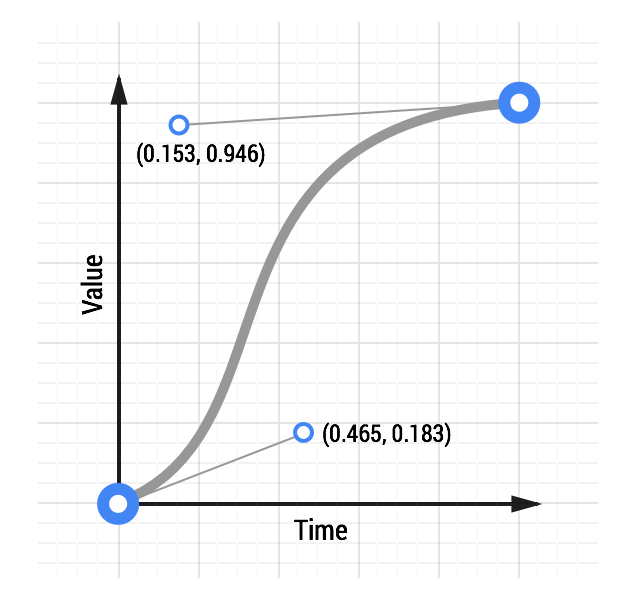

# 03 Custom Easing

**TL;DR**

- Custom easing will allow you to give more personality to your projects.
- You can create cubic bezier curves that resemble the default animation curves (ease-out, ease-in, etc) but with emphasis in different places.
- Use JavaScript when you need more control over the animation timing and behavior, e.g. elastic or bounce animations.

For comparison, here are two curves: a typical ease-in-out curve and a custom curve:

[See an animation with custom easing.](samples/box-move-custom-curve.html)

CSS:

    transition: transform 500ms cubic-bezier(0.465, 0.183, 0.153, 0.946);

Experiment with this [animation curve tool](samples/curve-playground.html) and see how the curve affects the feel of an animation.

### Use JavaScript for more control

[See an elastic ease animation.](samples/box-move-elastic.html)

HTML:

    

JS:

    var box = document.getElementById('my-box');
    var animationDurationInSeconds = 1.5;

    TweenMax.to(box, animationDurationInSeconds, {
      x: '100%',
      ease: 'Elastic.easeOut'
    });

The [TweenMax documentation](http://greensock.com/docs/#/HTML5/GSAP/TweenMax/) highlights all the options you have here, so it’s well worth a read.
