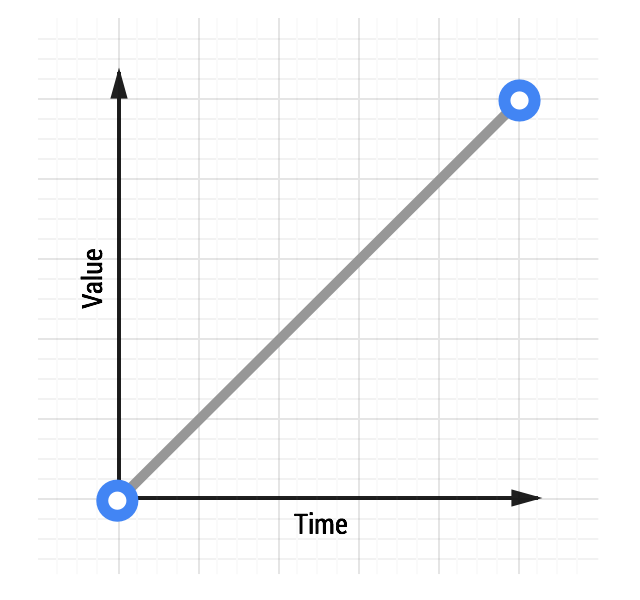
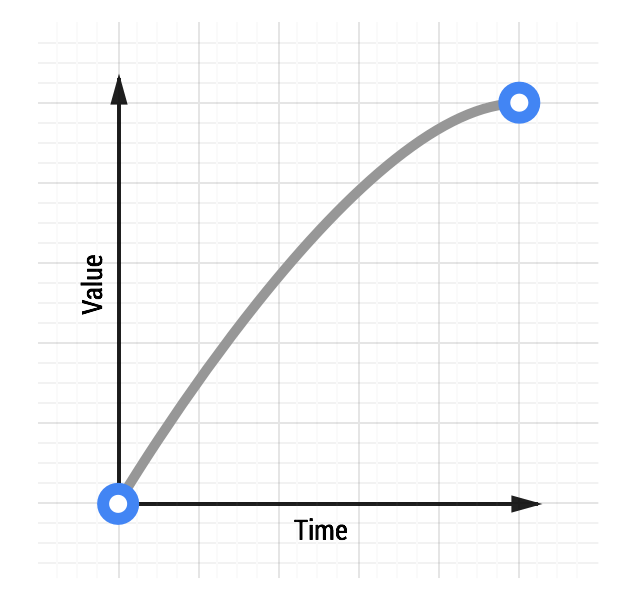
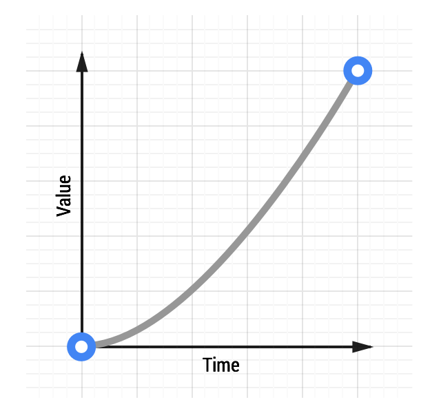
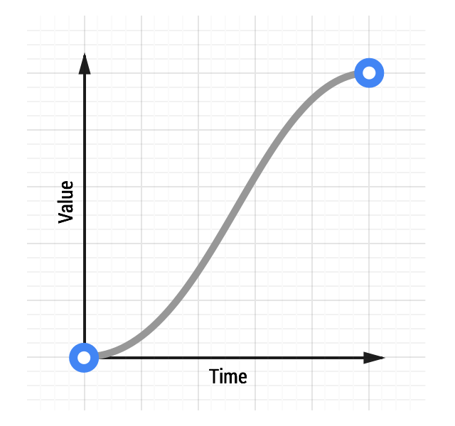

# 02 The Basics of Easing

**TL;DR**

- Easing makes your animations feel more natural.
- Choose `ease-out` animations for UI elements.
- Avoid `ease-in` or `ease-in-out` animations unless you can keep them short; they tend to feel sluggish to end users.

### Easing Keywords

Here are some of the keywords that you can use in CSS:

- `linear`
- `ease-in`
- `ease-out`
- `ease-in-out`

Source: [CSS Transitions, W3C](http://www.w3.org/TR/css3-transitions/#transition-timing-function-property)

### Linear animations

[See a linear animation.](samples/box-move-linear.html)

CSS:

    transition: transform 500ms linear;

### Ease-out Animations

Easing out causes the animation to start more quickly than linear ones, and it also has deceleration at the end.

CSS:

    transition: transform 500ms ease-out;

[See an ease-out animation.](samples/box-move-ease-out.html)

### Ease-in Animations

Ease-in animations start slowly and end fast; the opposite of ease-out.

[See an ease-in animation.](samples/box-move-ease-in.html)

CSS:

    transition: transform 500ms ease-in;

### Ease-in-out Animations

Easing both in and out is akin to a car accelerating and decelerating and, used judiciously, can provide a more dramatic effect than just easing out.

[See an ease-in-out animation.](samples/box-move-ease-in-out.html)

CSS:

    transition: transform 500ms ease-in-out;
