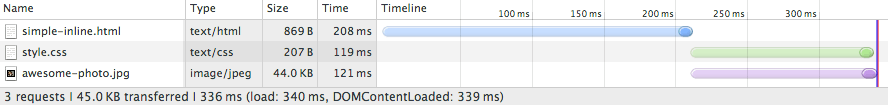
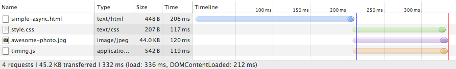
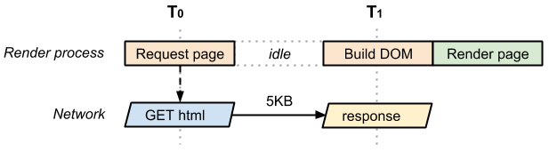
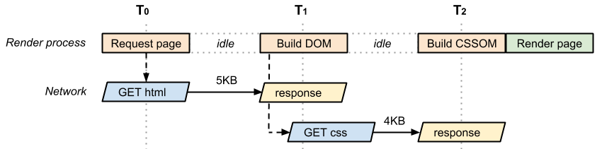

# 06 Analyzing Critical Rendering Path Performance

确定并解决关键呈现路径性能方面的瓶颈需要了解很多常见问题。让我们开始实践之旅，并找出常用的性能模式，从而帮助您优化网页。

优化关键呈现路径的目标是允许浏览器尽可能快地绘制网页：较快的页面呈现速度可以提高互动度、增加网页浏览量并[提高转化率](http://www.google.com/think/multiscreen/success.html)。因此，我们希望通过优化要加载的资源和加载顺序，尽可能减少访问者注视空白屏幕的时间。

为了更好地介绍这一过程，我们先从最简单的情况开始讲解，逐步构建我们的网页，使其包含更多资源、样式和应用逻辑；在此过程中，我们还会了解出错的位置，以及如何优化每种情况。

最后，在开始之前，我们还要处理一件事…到目前为止，我们一直专注于资源（CSS、JS 或 HTML 文件）可进行处理之后浏览器中会发生什么，但忽略了从缓存或网络中提取资源的时间。在下一课中，我们将深入研究如何细致优化应用的网络方面，但同时（为了更贴近现实）我们将做出以下假设：

- 到服务器的网络往返（传播延迟）将花费 100 毫秒
- HTML 文档的服务器响应时间为 100 毫秒，而其他所有文件的响应时间均为 10 毫秒

The Hello World experience

    <html>
      <head>
        <meta name="viewport" content="width=device-width,initial-scale=1">
        <title>Critical Path: No Style</title>
      </head>
      <body>
        
Hello web performance students!

        

      </body>
    </html>

[sample](samples/basic_dom_nostyle.html)

我们将从基本的 HTML 标记和单个无 CSS 或 JavaScript 的图片开始，这与获得图片一样简单。现在，我们在 Chrome DevTools 中打开网络时间轴，并检查生成的资源瀑布流：

不出所料，HTML 文件的下载时间大约为 200 毫秒。注意，蓝色线的透明部分表示浏览器在网络上等待（即尚未收到任何响应字节）的时间，而实体部分则显示收到第一个响应字节之后完成下载的时间。在上述示例中，HTML 下载量极少（不足 4K），因此我们仅需单个往返过程即可提取整个文件。因此，提取 HTML 文档大约耗时 200 毫秒，其中一半的时间花费在等待网络上，而另一半花费在服务器响应上。

HTML 内容准备就绪后，浏览器必须解析字节、将其转换为令牌，并构建 DOM 树。注意，DevTools 可以方便地在底部报告 DOMContentLoaded 事件的时间（216 毫秒），该时间也与蓝色垂直线相对应。HTML 下载结束和蓝色垂直线 (DOMContentLoaded) 之间的间隔是浏览器构建 DOM 树花费的时间，在此示例中仅为几毫秒。

最后，请注意一些有趣的事情：我们的’趣照’没有阻止 domContentLoaded 事件！ 这证明，我们无需等待网页上的每个资源即可构建呈现树甚至绘制网页：**不是所有资源均对提供首次描绘起重要作用。**事实上，就像我们将要看到的，我们谈论关键呈现路径时，通常谈论的是 HTML 标记、CSS 和 JavaScript。图片不会阻止网页的首次呈现，尽管如此，我们也应努力确保系统尽快绘制图片！

不过，系统会阻止图片上的load事件（亦常称为onload）：DevTools 在 335 毫秒时报告 onload 事件。回想一下，onload 事件标记的点是网页所需的**所有资源**均已下载并经过处理的点，这是加载微调控件可以在浏览器中停止微调的点，并且该点使用瀑布流中的红色垂直线进行标记。

## Adding JavaScript and CSS into the mix

我们的’Hello World experience’页面表面看起来可能非常简单，但我们需要做大量的工作才能使其呈现出这种效果！ 不过在实践中，我们还需要 HTML 之外的很多资源：我们可能需要 CSS 样式表以及一个或多个添加网页互动性的脚本。我们将两者组合起来，看看会发生什么：

    <html>
      <head>
        <title>Critical Path: Measure Script</title>
        <meta name="viewport" content="width=device-width,initial-scale=1">
        <link href="style.css" rel="stylesheet">
      </head>
      <body onload="measureCRP()">
        
Hello web performance students!

        

        
      </body>
    </html>

[sample](samples/measure_crp_timing.html)

Before adding JavaScript and CSS:

With JavaScript and CSS:

添加外部 CSS 和 JavaScript 文件额外增加了两个针对瀑布流的请求（浏览器几乎会同时分派这两个请求），目前一切顺利。但请注意，**现在，domContentLoaded 事件和 onload 事件之间的时间差小多了。这是怎么回事？**

- 与纯 HTML 示例不同，我们现在还需要提取并解析 CSS 文件以构建 CSSOM，而且我们必须使用 DOM 和 CSSOM 来构建呈现树。
- 因为我们的网页上还有一个阻止解析器的 JavaScript 文件，因此在系统下载并解析 CSS 文件之前，domContentLoaded 事件将被阻止：JavaScript 可能会查询 CSSOM，因此在执行 JavaScript 之前，我们必须阻止和等待 CSS。

**如果我们使用内联脚本代替外部脚本会怎样？**表面上看这是一个微不足道的问题，但实际上却非常棘手。结果证明，即使将脚本直接内联到网页中，浏览器得知脚本意图的唯一可靠方式还是执行该脚本，而且正如我们了解的那样，在 CSSOM 构建完成之前，我们不能直接内联脚本。简言之，内联 JavaScript 也会阻止解析器。

不过，虽然内联脚本会阻止 CSS，但此操作仍可以加快网页呈现速度吗？ 如果最后一种情况很棘手，那这个问题会更棘手！ 我们试着操作下，看看会发生什么…

External JavaScript:

Inlined JavaScript:

我们减少了一个请求，但是 onload 和 domContentLoaded 的时间仍没有变化，为什么？ 这与 JavaScript 是内联的还是外部的没有关系，因为只要浏览器遇到脚本代码，它就会阻止和等待，直到 CSSOM 构建完成。另外，在我们的第一个示例中，浏览器是同时下载 CSS 和 JavaScript 的，而且下载行为几乎是在同一时间完成的。因此，在这一特定实例中，内联 JavaScript 代码没有太大意义！ 那我们就陷入僵局，没法提高网页呈现速度了吗？ 实际上，我们有多个不同的应对策略。

首先回想一下，所有内联脚本均会阻止解析器，但是对于外部脚本来说，我们可以添加async关键字来取消阻止解析器。我们来取消内联，并尝试一下上述方法：

    <html>
      <head>
        <title>Critical Path: Measure Async</title>
        <meta name="viewport" content="width=device-width,initial-scale=1">
        <link href="style.css" rel="stylesheet">
      </head>
      <body onload="measureCRP()">
        
Hello web performance students!

        

        
      </body>
    </html>

[sample](samples/measure_crp_async.html)

Parser-blocking (external) JavaScript:

Async (external) JavaScript:

好多了！ 解析 HTML 之后不久即会触发 domContentLoaded 事件：浏览器已得知不要阻止 JavaScript，而且因为没有其他阻止解析器的脚本，CSSOM 构建也可以同步进行了。

或者，我们也可以尝试另外一种方法，即同时内联 CSS 和 JavaScript：

    <html>
      <head>
        <title>Critical Path: Measure Inlined</title>
        <meta name="viewport" content="width=device-width,initial-scale=1">
        
      </head>
      <body>
        
Hello web performance students!

        

        
      </body>
    </html>

[sample](samples/measure_crp_inlined.html)

注意：domContentLoaded 时间与前面示例中的时间没有区别：我们没有将 JavaScript 设置为异步，而是将 CSS 和 JS 同时内联到网页本身。这使得我们的 HTML 网页更大，但好处是浏览器无需等待提取外部资源，每个元素都已纳入网页。

如您所见，即使是非常简单的网页，优化关键呈现路径也不是一件轻而易举的事情：我们需要了解不同资源之间的依存关系图，需要确定哪些资源是’重要资源’，而且我们必须在名目繁多的策略中做出选择，找出在网页中添加这些资源的恰当方式。该问题不是一个方案可以解决的，每个网页都不尽相同，因此您必须按照相似的解决流程，找出最佳策略。

## Performance Patterns

最简单的可用网页仅由 HTML 标记组成：无 CSS、JavaScript 或其他类型的资源。要呈现此网页，浏览器必须初始化请求、等待 HTML 文档准备就绪、对其进行解析、构建 DOM，最后使其呈现在屏幕上：

    <html>
      <head>
        <meta name="viewport" content="width=device-width,initial-scale=1">
        <title>Critical Path: No Style</title>
      </head>
      <body>
        
Hello web performance students!

        

      </body>
    </html>

[sample](samples/basic_dom_nostyle.html)

**T0 和 T1 之间的时间用于捕获网络和服务器处理时间。** 在最理想的情况（HTML 文件较小）下，我们仅需一个网络往返过程即可提取整个文档；由于 TCP 传输协议的工作方式，较大的文件可能需要多个往返过程，我们将在以后的课程中重新探讨这一主题。**因此，在最理想的情况下，上述网页具有一个往返过程（最少）关键呈现路径。**

现在，我们看一下带有外部 CSS 文件的同一网页：

    <html>
      <head>
        <meta name="viewport" content="width=device-width,initial-scale=1">
        <link href="style.css" rel="stylesheet">
      </head>
      <body>
        
Hello web performance students!

        

      </body>
    </html>

[sample](samples/analysis_with_css.html)

再重复一下，我们需要一个网络往返过程来提取 HTML 文档，然后检索到的标记告知我们还需要 CSS 文件：这意味着，浏览器必须返回服务器并获取 CSS，然后才能在屏幕上呈现网页。**因此，该网页最少需要两个往返过程才能显示**，重复一下，CSS 文件可能需要多个往返过程，因此重点在’最少’。

我们来定义将用于描述关键呈现路径的词汇：

- **关键资源**：可能阻止网页首次呈现的资源。
- **关键路径长度**：即往返过程数量，或提取所有关键资源所需的总时间。
- **关键字节**：实现网页首次呈现所需的总字节数，是所有关键资源的传输文件大小总和。 带有一个 HTML 网页的首个示例包含一项关键资源（HTML 文档），关键路径长度也与 1 个网络往返过程（假设文件较小）相等，而且总的关键字节数正好是 HTML 文档本身的传输大小。
