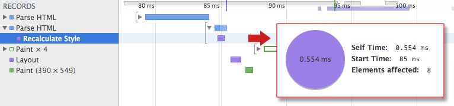

# 01 Constructing the Object Model

浏览器需要先构建 DOM 和 CSSOM 树，才能呈现网页。因此，需要确保尽快将 HTML 和 CSS 提供给浏览器。

**TL;DR**

- Bytes → characters → tokens → nodes → object model.
- HTML markup is transformed into a Document Object Model (DOM), CSS markup is transformed into a CSS Object Model (CSSOM).
- DOM and CSSOM are independent data structures.
- Chrome DevTools Timeline allows us to capture and inspect the construction and processing costs of DOM and CSSOM.

## Document Object Model (DOM)

    <html>
      <head>
        <meta name="viewport" content="width=device-width,initial-scale=1">
        <link href="style.css" rel="stylesheet">
        <title>Critical Path</title>
      </head>
      <body>
        
Hello web performance students!

        

      </body>
    </html>

[sample](samples/basic_dom.html)

首先，我们从最简单的情况开始讲解：一个纯 HTML 网页，包含一些文字和一张图片。浏览器需要怎样做才能处理这个简单的网页呢？

1. **转换**：浏览器从磁盘或网络读取 HTML 的原始字节，然后根据指定的文件编码格式（例如 UTF-8）将其转换为相应字符。
2. **令牌化**：浏览器将字符串转换为 [W3C HTML5 标准](http://www.w3.org/TR/html5/) 指定的不同令牌 - 例如`<html>`、`<body>`以及其他带’尖括号’的字符串。每个令牌都具有特殊的含义和一套规则。
3. **词法分析**：发出的令牌转换为定义其属性和规则的’对象’。
4. **DOM 构建**：最后，因为 HTML 标记定义不同标签之间的关系（某些标签嵌套在其他标签中），所以，创建的对象在树状数据结构中链接起来，树状数据结构还会捕获原始标记中定义的父子关系：比如 HTML 对象是 body 对象的父对象，body 是 paragraph 对象的父对象等等。

**上述整个流程的最终输出是文档对象模型，即这个简单网页的DOM，浏览器会使用该 DOM 完成对相应网页的所有后续处理。**

每次浏览器处理 HTML 标记时，必须完成上述所有步骤：将字节转换为字符，标识令牌，将令牌转换为节点，然后构建 DOM 树。整个过程可能需要一段时间，尤其在要处理大量 HTML 时更是如此。

---

**Note**

- 我们假定您对 Chrome DevTools 有基本的了解 - 也就是说，您知道如何捕获网络瀑布流或记录时间轴。如果您需要快速重温一下相关知识，请访问 [Chrome DevTools documentation](https://developer.chrome.com/devtools)，如果您是首次使用 DevTools，则建议学习 Codeschool [Discover DevTools](http://discover-devtools.codeschool.com/) 课程。

---

如果您打开 Chrome DevTools，并在网页加载时记录时间轴，可以看到执行此步骤所需的实际时间 - 在上例中，将 HTML 字节转换为 DOM 树大约需要 5 毫秒。当然，如果网页更大（大多数网页都是如此），此过程需要的时间可能会长很多。在后面关于创建流畅动画的章节中，您会看到，如果浏览器必须处理大量 HTML，这很可能成为一个瓶颈问题。

## CSS Object Model (CSSOM)

在浏览器构建这个简单网页的 DOM 时，在文档的 head 部分会遇到一个 link 标签，用于引用外部 CSS 样式表 style.css。浏览器预见到将需要此资源来呈现网页，因此会立即发出对此资源的请求，该请求会返回以下内容：

    body { font-size: 16px }
    p { font-weight: bold }
    span { color: red }
    p span { display: none }
    img { float: right }

[sample](samples/style.css)

当然，我们本可以直接在 HTML 标记中声明样式（内联），但是，如果将 CSS 与 HTML 分开，我们就可以将内容和设计分别进行处理：设计人员可以处理 CSS，开发人员可以处理 HTML 等等。

与 HTML 相同，我们需要将收到的 CSS 规则转换为浏览器可以理解和处理的内容。因此，我们再重复一次与处理 HTML 非常类似的过程：

CSS 字节会转换为字符，然后转换为令牌和节点，最后链接到树状结构上，称为’CSS 对象模型’，或缩写为 CSSOM：

CSSOM 为什么采用树状结构？ 在为网页上的任何对象计算最终的样式集时，浏览器会先从适用于该节点的最通用规则开始（例如，如果是 body 元素的子元素，则应用所有 body 样式），然后，通过应用更加具体的规则（即规则向下级联），递归细化计算的样式。

为了更具体地进行说明，我们来看一下上面所述的 CSSOM 树。body 元素中 span 标记内包含的任何文字均采用 16 磅的字体大小，采用红色文字 - font-size 指令从 body 向下级联到 span。但是，如果 span 标签是 paragraph (p) 标签的子标签，则不会显示其内容。

此外，请注意，上述树不是完整的 CSSOM 树，只显示我们决定在样式表中覆盖的样式。每个浏览器都会提供一套默认的样式，也称为’用户代理样式’ – 即不提供任何自定义样式时看到的样式 – 我们的样式只是覆盖这些默认样式集（例如 [默认 IE 样式](http://www.iecss.com/)）。如果您曾在 Chrome DevTools 中检查过’计算的样式’，并且想知道所有样式从何而来，现在您应该知道答案了！

想知道 CSS 处理所需的时间？ 在 DevTools 中记录时间轴，并查找’Recalculate Style’事件：与 DOM 解析不同，时间轴不显示单独的’Parse CSS’条目，而是捕获解析和 CSSOM 树构建，加上此事件下计算的样式的递归计算。

处理我们的小样式表需要大约 0.6 毫秒，且会影响网页上的 8 个元素 – 时间不多，但也会产生成本。但是，8 个元素从何而来呢？ CSSOM 和 DOM 是独立的数据结构！ 原来，浏览器隐藏一个重要的步骤。接下来，我们介绍将 DOM 和 CSSOM 链接在一起的呈现树形结构。
