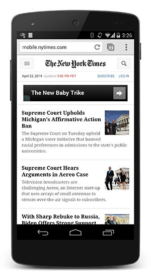

# 03 Render Blocking CSS

在默认情况下，CSS 会被视为阻止呈现的资源，这意味着只要未构建 CSSOM，即使已经处理的内容，浏览器也不会进行呈现。一定要保持 CSS 简洁，尽快提供 CSS，并使用媒体类型和媒体查询来解除对呈现的阻止。

在上一节，我们看到关键呈现路径要求同时具备 DOM 和 CSSOM 才能构造呈现树，这对性能有很重要的含义：HTML 和 CSS 都是阻止呈现的资源。 对 HTML 的要求显而易见，因为如果没有 DOM，就没有任何可呈现的内容，但是对 CSS 的要求也许没那么显而易见。如果我们尝试呈现一个普通网页，而不让 CSS 阻止呈现，会发生什么情况？

**TL;DR**

- 默认情况下，CSS 会被视为阻止呈现的资源。
- 通过媒体类型和媒体查询，可以将一些 CSS 资源标记为不阻止呈现的资源。
- 无论阻止还是不阻止，浏览器会下载所有 CSS 资源。

上面的例子分别展示了具备 CSS 和没有 CSS 时的纽约时报网站，这表明了为什么在 CSS 可用之前阻止呈现 - 没有 CSS 的网页实际上是无法使用的。实际上，右侧的体验通常称为’内容样式短暂失效’(FOUC)。所以，在同时具备了 DOM 和 CSSOM 之前，浏览器会阻止呈现。

**CSS 是阻止呈现的资源，需要将 CSS 尽早、尽快地提供给客户端，以便缩短首次呈现的时间。**

但是，如果一些 CSS 样式只能在特定条件下使用，该怎么办？例如，在打印网页时，或者在将网页投影到大屏幕时。如果这些资源不阻止呈现，那就太棒了！

通过 CSS’媒体类型’和’媒体查询’可以处理这种情况：

    <link href="style.css" rel="stylesheet">
    <link href="print.css" rel="stylesheet" media="print">
    <link href="other.css" rel="stylesheet" media="(min-width: 40em)">

[媒体查询](https://developers.google.com/web/fundamentals/layouts/rwd-fundamentals/use-media-queries.html) 由媒体类型以及零个或多个表达式组成，表达式用于检查特定媒体特征的条件。例如，我们的第一个样式表声明没有提供任何媒体类型或媒体查询，因此，将适用于所有情况 - 也就是说，始终会阻止呈现。另一方面，第二个样式表将只适用于打印内容时 - 也许您希望重新设置布局、更改字体等等 - 因此，在首次加载网页时，这个样式表不需要阻止网页的呈现。最后一个样式表声明提供了由浏览器执行的媒体查询：如果符合条件，在该样式表下载并处理完之前，浏览器将阻止呈现。

通过使用媒体查询，可以根据具体用途（例如显示还是打印）来定制外观，也可以根据动态条件（例如屏幕方向改变、大小调整等事件）来定制外观。**在声明样式表资源时，一定要认真注意媒体类型和媒体查询，因为它们将对关键呈现路径产生巨大的性能影响！**

下面就让我们看一些简单的例子：

    <link href="style.css"    rel="stylesheet">
    <link href="style.css"    rel="stylesheet" media="screen">
    <link href="portrait.css" rel="stylesheet" media="orientation:portrait">
    <link href="print.css"    rel="stylesheet" media="print">

- 第一个声明是阻止呈现的，并且符合所有条件。
- 第二个声明也是阻止呈现的：’screen’是默认的类型，如果未指定任何类型，则默认设置为’screen’。因此，第一个声明和第二个声明实际上是一样的。
- 第三个声明包含动态媒体查询，在加载网页时将评估该查询。根据加载网页时设备的方向，决定 portrait.css 是否阻止呈现。
- 最后一个声明只适用于打印网页时，因此，在浏览器中首次加载网页时，不会阻止呈现。

最后，请注意，’阻止呈现’仅指该资源是否会阻止浏览器首次呈现网页。无论是否阻止，浏览器仍会下载 CSS 资源，只是非阻止性资源的优先级较低而已。
