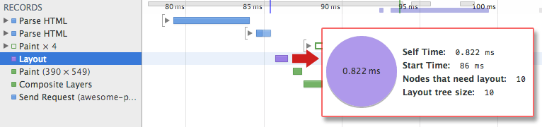

# 02 Render-tree construction, Layout, and Paint

DOM 树和 CSSOM 树将合并构成呈现树。用于计算每个可视元素的布局，并作为绘制过程的输入参数，用于在屏幕上呈现各个像素。优化其中的每一步都对实现最佳呈现效果至关重要。

**TL;DR**

- DOM 树和 CSSOM 树合并成呈现树。
- 呈现树只包含呈现网页所需的节点。
- 布局会计算每个对象的精确位置和尺寸。
- 绘制是最后一步，以最终的呈现树作为输入参数，在屏幕上呈现各个像素。

对浏览器而言，第一步便是将 DOM 树和 CSSOM 树合并成’呈现树’，使其既包含网页上所有可见的 DOM 内容，又包含各个节点的 CSSOM 样式信息。

为了构建呈现树，浏览器大致需要执行如下步骤：

1. 从 DOM 树的根节点开始，遍历每个可见的节点。
    - 某些节点根本不可见（例如 script 标签、meta 标签等）。由于呈现的输出内容中不会反映这些节点，因此会被省略。
    - 某些节点通过 CSS 隐藏起来，在呈现树中也会被省略。比方说，上例中的 span 节点。由于该节点通过显式规则设置了`display:none`属性，因此不会出现在呈现树中。
2. 为每个可见的节点找到匹配的 CSSOM 规则，并应用这些规则。
3. 发送可见的节点，包括内容及其计算出来的样式。

---

**Remember**

- 简单提一句，请注意，`visibility: hidden`与`display: none`不同。前者会隐藏元素，但这个元素在布局中仍会占据相应空间（其实就是一个空白方框）；而后者 (display: none) 会直接从呈现树中彻底移除元素，该元素不光是不可见，而且也不属于布局的一部分。

---

最终输出的呈现树既包含屏幕上显示的所有可见内容，又包含相应的样式信息。快要大功告成了！ **有了呈现树，我们就能进入’布局’阶段。**

到目前为止，我们已经计算了哪些节点应为可见节点及其计算的样式，但是尚未计算节点在设备的 [视口](https://developers.google.com/web/fundamentals/layouts/rwd-fundamentals/set-the-viewport.html) 中的准确位置和尺寸。这就是在’布局’阶段（有时也称为’回流’）所要做的工作。

为了计算出每个对象的准确尺寸和位置，浏览器从呈现树的根节点开始遍历，以计算网页上每个对象的几何形状。下面就让我们看一个简单的例子：

    <html>
      <head>
        <meta name="viewport" content="width=device-width,initial-scale=1">
        <title>Critial Path: Hello world!</title>
      </head>
      <body>
        

          
Hello world!

        

      </body>
    </html>

[sample](samples/nested.html)

以上网页的正文包含两个嵌套的 div：第一个 div（父元素）将节点的显示尺寸设置为视口宽度的 50%，第二个 div（包含在父元素中）将宽度设置为父元素的 50%，即视口宽度的 25%！

布局过程的输出结果称为’盒子模型’，它精确说明了每个元素在视口中的准确位置和尺寸：所有相对度量单位会转化为在屏幕上的绝对像素位置。

最后，既然知道了哪些节点可见、节点计算的样式以及几何形状，我们终于可以将这些信息传递到最后一个阶段，将呈现树中的每个节点转换为屏幕上的实际像素 - 此步骤通常称为’绘制’或者’格栅化’。

- 在时间轴中通过’Layout’事件捕获呈现树的构建以及位置和尺寸的计算。
- 一旦布局完成，浏览器便抛出’Paint Setup’和’Paint’事件，将呈现树转化为屏幕上的实际像素。

呈现树的构建、布局和绘制所需的时间取决于文档的大小、应用的样式，当然还有运行文档的设备：文档越大，浏览器需要完成的工作就越多；样式越复杂，绘制所需的时间就越长（例如，绘制单色’成本较低’，而计算和呈现阴影就’成本较高’）。

一旦完成上述步骤，我们的网页便会最终呈现在视口上！

让我们快速回顾一下浏览器执行的所有步骤：

1. 处理 HTML 标记，生成 DOM 树。
2. 处理 CSS 标记，生成 CSSOM 树。
3. 将 DOM 树和 CSSOM 树合并为呈现树。
4. 对呈现树进行布局，计算每个节点的几何形状。
5. 在屏幕上绘制各个节点。

**优化关键呈现路径就是尽可能缩短上述第 1 步到第 5 步所花费的总时间。** 这样，我们可以尽早在屏幕上呈现内容，还可以缩短首次呈现后屏幕刷新的时间间隔 - 也就是说，提高交互式内容的刷新率。
